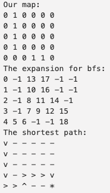
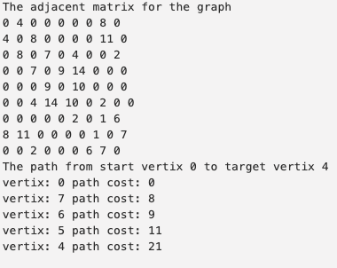

# Algorithms
# Hands-on implementation of classical algorithms
## 1. bfs for shortest path in grid

## 2. A star for shortest path in grid

## 3. Dijkstra for shortest path in graph

## 4. fitting a plane with linear algebra

References: 
[(https://math.stackexchange.com/questions/99299/best-fitting-plane-given-a-set-of-points)](https://math.stackexchange.com/questions/99299/best-fitting-plane-given-a-set-of-points)
## 5. fitting a plane with svd and ransace (using ransac for outlier rejection)
`Choose a minimum of 3 points from xyz_ground at random.
`Compute the ground plane model using the chosen random points, and the provided function compute_plane.
`Compute the distance from the ground plane model to every point in xyz_ground, and compute the number of inliers based on a distance threshold.
4. Check if the current number of inliers is greater than all previous iterations and keep the inlier set with the largest number of points.
5. Repeat until number of iterations  ≥  a preset number of iterations, or number of inliers  ≥  minimum number of inliers.
Recompute and return a plane model using all inliers in the final inlier set.
